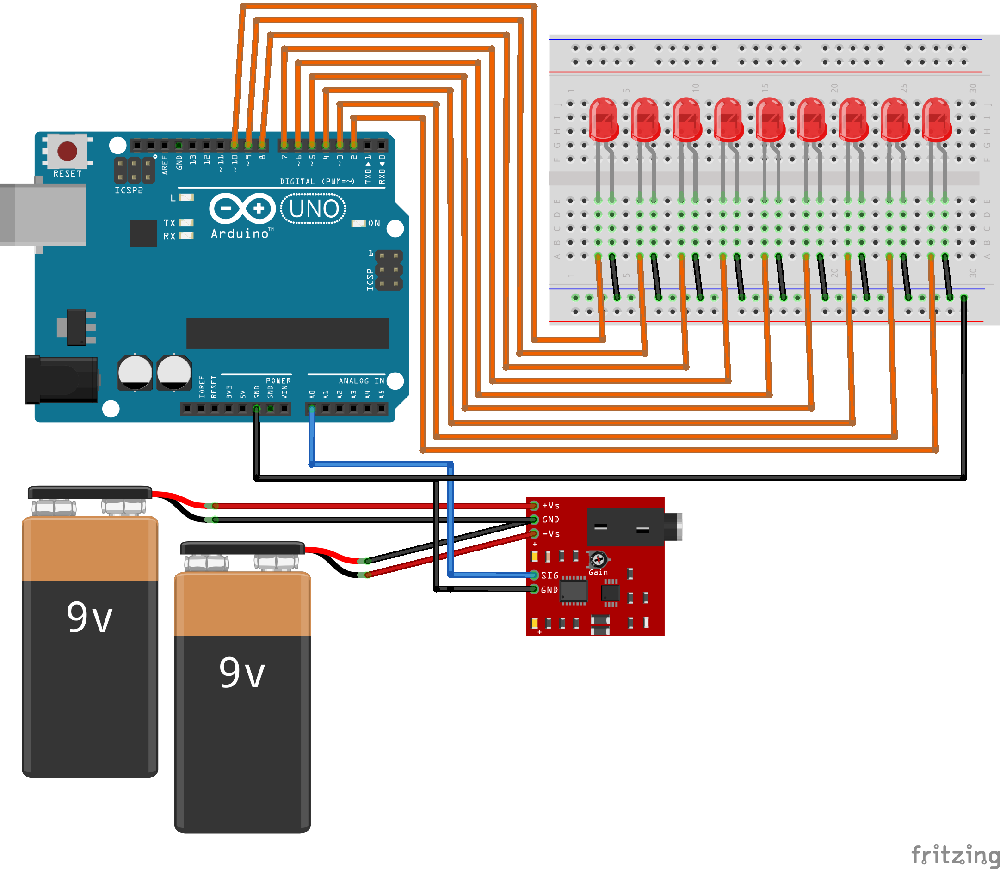

# Stress Level Detector

### Objective

This project aims to detect and visualize muscle stress levels using an analog sensor (such as a Force Sensitive Resistor or a simple biofeedback sensor) connected to an Arduino board. The core principle is to measure the change in a physical parameter (like resistance or muscle activity) and map it to a visual representation on a bar graph of nine LEDs. The project records eight consecutive sensor readings, calculates their average, and uses this average value to determine the stress level. The more LEDs that light up, the higher the detected stress level.

### How it Works

1.  **Analog Reading:** The Arduino's analog input pin (A0) continuously reads data from the sensor.
2.  **Averaging:** The code takes eight successive readings, sums them up, and then calculates the average. This helps to smooth out any noise or quick fluctuations in the sensor data, providing a more stable and accurate reading.
3.  **Visualization:** The averaged sensor value (`sensorValue`) is then compared against a series of predefined ranges.
4.  **LED Bar Graph:** A corresponding number of LEDs, connected to digital pins 2 through 10, are lit up based on the stress level. For example:
    * An average value of `165` to `170` lights up the first LED.
    * A value of `170` to `175` lights up the first two LEDs, and so on.
    * A value of `205` or higher lights up all nine LEDs, indicating maximum stress.

### Circuit Diagram

A circuit diagram illustrating the component connections is provided in the `Stress_level_detector.png` file.

### Contributors

* Rohit E
* Podala Keerthana
* Viswasurya P
